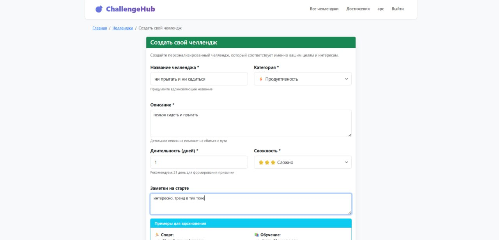
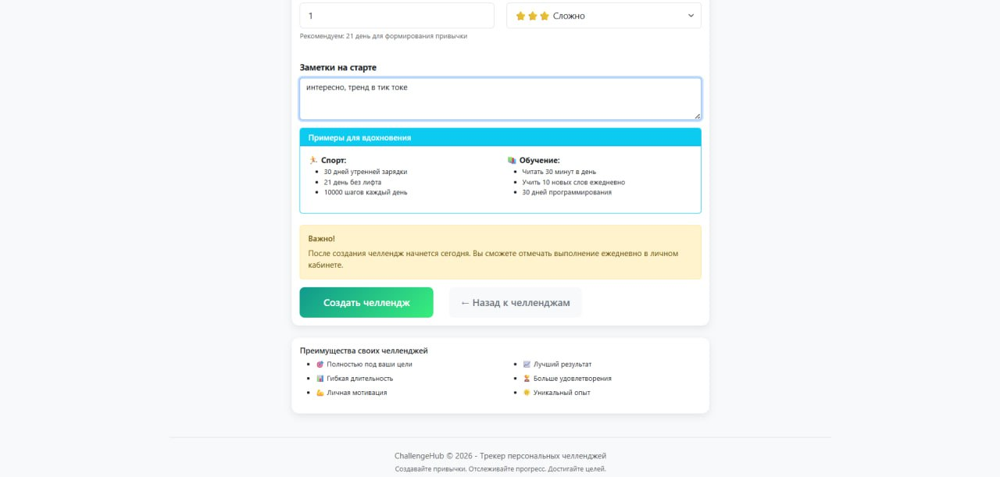
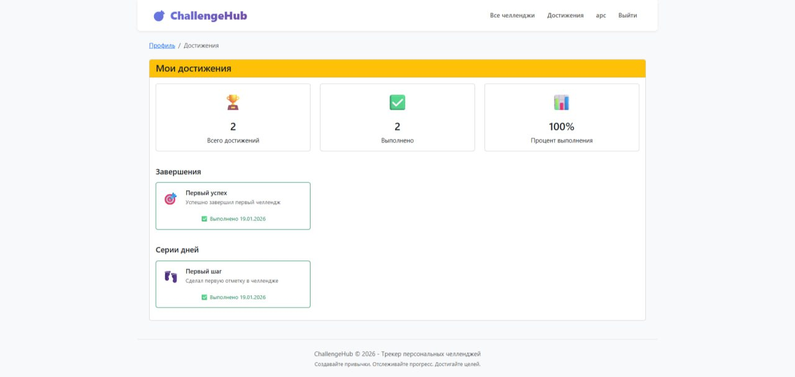

# ChallengeHub — Трекер персональных челленджей

Веб-сервис для трекинга персональных челленджей и формирования полезных привычек с Data Science аналитикой. Система помогает ставить цели, отслеживать ежедневный прогресс, визуализировать статистику и мотивирует через систему достижений.

Ссылка на рабочий проект: https://challengehub-2.onrender.com

## Технологии
- **Backend**: Python 3.13, Django 4.2.11, SQLite / PostgreSQL
- **Frontend**: Bootstrap 5, HTML5 / CSS3 / JavaScript, Plotly.js
- **Data Science**: Plotly 6.5.0, Pandas 2.3.3
- **Деплой**: Render

## Data Science
Проект использует библиотеки анализа данных:

1. Plotly - интерактивные графики прогресса и статистики
2. Pandas - расчеты статистики, агрегация данных, анализ трендов

## Скриншоты

*Главная страница с призывом к действию и популярными категориями*

*Личный кабинет с прогрессом всех челленджей*

*Data Science аналитика с графиками Plotly и статистикой*

*Страница с челленджами*

*Календарь для нагляного отслеживания процесса*

*Ежедневная отметка - форма с историей отметок*

*Достижения, система мотивационных достижений*

## Как запустить проект локально
1. **Клонируйте репозиторий**
git clone https://github.com/Aurroora/challengehub.git
cd challengehub
2. **Создайте виртуальное окружение**
python -m venv venv
Для Linux/Mac: source venv/bin/activate
Для Windows: venv\Scripts\activate
3. **Установите зависимости**
pip install -r requirements.txt
4. **Примените миграции**
python manage.py migrate
5. **Создайте суперпользователя (по желанию)**
python manage.py createsuperuser
6. **Запустите сервер**
python manage.py runserver
6. **Откройте проект в браузере: http://127.0.0.1:8000/**

Автор: Попова Анна