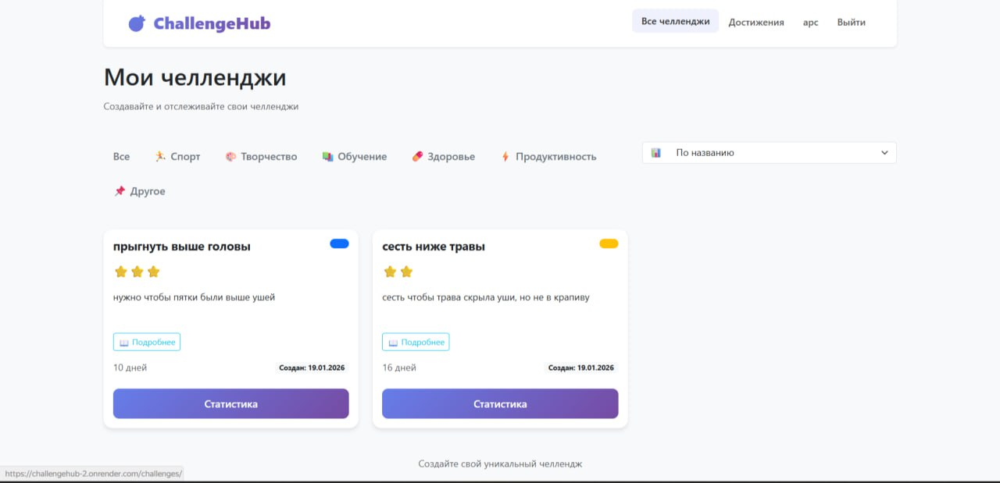
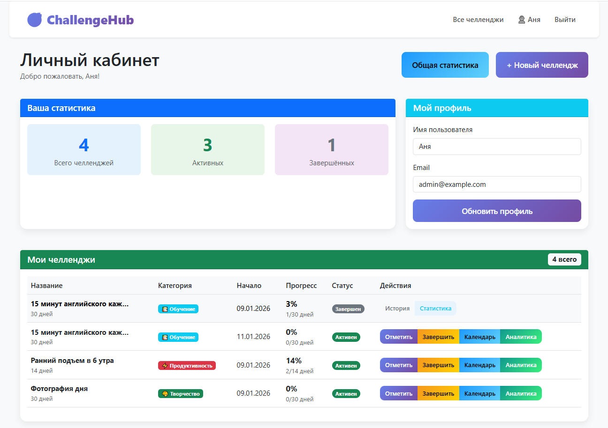
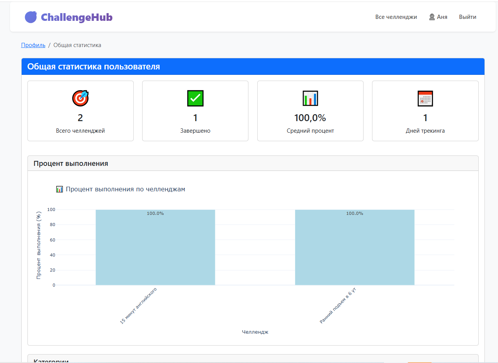
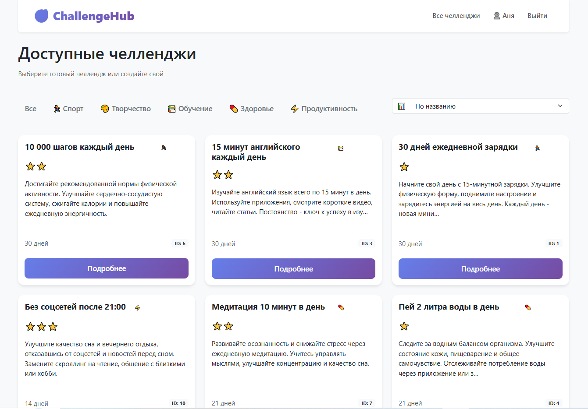

# ChallengeHub

Веб-сервис для трекинга персональных челленджей и формирования полезных привычек.

## Функционал
- **Каталог челленджей** - готовые шаблоны по категориям (спорт, обучение, здоровье и т.д.)
- **Персональные челленджи** - возможность создать свой уникальный челлендж
- **Ежедневные отметки** - система ежедневного трекинга с оценками и заметками
- **Визуализация прогресса** - календари, графики, прогресс-бары
- **Data Science аналитика** - статистика, графики Plotly, расчеты Pandas
- **Личный кабинет** - вся статистика в одном месте

## Технологии
- **Backend**: Python 3.13, Django 4.2.11
- **Frontend**: Bootstrap 5.3, HTML5, CSS3, JavaScript
- **Data Science**: Plotly 6.5.0, Pandas 2.3.3
- **База данных**: SQLite (разработка), PostgreSQL (продакшн)
- **Деплой**: Render

## Data Science
Проект использует библиотеки анализа данных:

1. Plotly - интерактивные графики прогресса и статистики
2. Pandas - расчеты статистики, агрегация данных, анализ трендов

## Скриншоты
 
*Главная страница с призывом к действию и популярными категориями*

 
*Личный кабинет с прогрессом всех челленджей*

*Data Science аналитика с графиками Plotly и статистикой*

*Страница с челленджами*

*Календарь для нагляного отслеживания процесса*

## Как запустить проект локально
1. **Клонируйте репозиторий**
git clone https://github.com/Aurroora/challengehub.git
cd challengehub
2. **Создайте виртуальное окружение**
python -m venv venv
Для Linux/Mac: source venv/bin/activate
Для Windows: venv\Scripts\activate
3. **Установите зависимости**
pip install -r requirements.txt
4. **Примените миграции**
python manage.py migrate
5. **Запустите сервер**
python manage.py runserver
6. **Откройте проект в браузере: http://127.0.0.1:8000/**